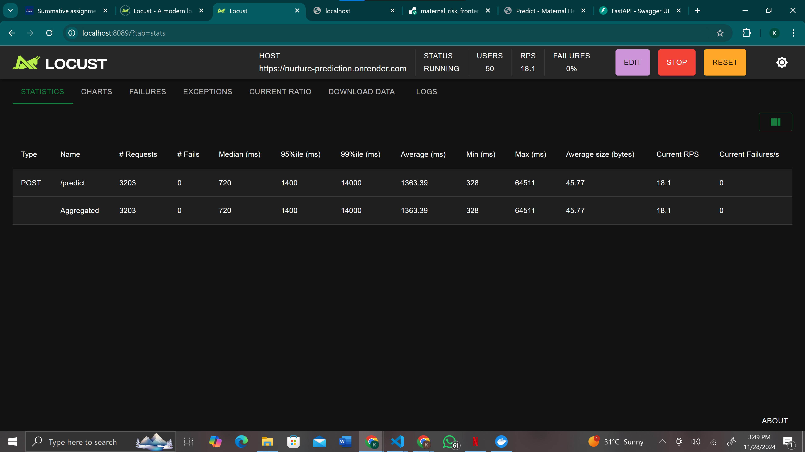

# Nurture_prediction

## Project Description

The Nurture Prediction app predicts maternal health risks using a machine learning model. The app classifies patients into different risk levels: **High Risk**, **Mid Risk**, and **Low Risk**. It features a Flask-based web application where users can input patient data for risk predictions, upload new data for model retraining, and explore various visualizations of the dataset.

## Features

1. Prediction Page: Allows users to input patient data and receive risk predictions.

2. Dashboard: Visualizations showcasing insights from the dataset.

3. Data Upload: Users can upload new data to the system for model retraining.

4. Retrain Model: A trigger to retrain the machine learning model based on new data.

5. Flood Simulation: Tests system performance under a high load of prediction requests using Locust.

6. Dockerized Deployment: App is fully containerized for ease of deployment and scaling.

## Video Demo and Live Link to App

- **Video Demo:** https://www.youtube.com/watch?v=rGxf8us1sL8

- **Live App:** https://maternal-risk-frontend-latest.onrender.com

- **Docker Image:** `kathrineg/maternal_risk_frontend:latest`

- **Deployed link(Swagger UI):** https://nurture-prediction.onrender.com/docs

## Navigating the Deployed App

The deployed app contains five key pages:

1. **Home:** An overview of the project, including its purpose and features.

2. **Preprocess:** Details the preprocessing steps applied to the dataset before training the model.

3. **Visualizations:** Provides insights into the dataset's features and their impact on maternal health risk predictions.

4. **Retrain:** Users can upload a CSV file to retrain the model. The file should contain all 7 columns of feature data. Navigate to `data/uploads` to download sample files, rename them to your likeness and upload them. After uploading click on the Retrain button to retrain. After retraining, a success message with the model version will appear. For evaluation metrics, visit the Deployed link(Swagger UI) link above, do the same process of uploading file and then retrain, your evaluation metrics will appear there .

5. **Predict:** Input feature values and click **Predict** to receive risk level predictions. This page also explains the meaning of each predicted value and includes instructions for proper use.

Please NOTE that it may take some time to process requests for retraining and prediction due to periods of inactivity. We kindly ask for your patience as the server activates and begins processing.

## Docker Image Deployment

The image was deployed on render and is live, however if you would like to directly pull and run it locally using Docker, here are the steps:

In your terminal,

1. Pull the docker image, run the following command:

```
docker pull kathrineg/maternal_risk_frontend:latest
```

2. Run the image by executing the command:

```
docker run -p 5000:5000 maternal_risk_frontend:latest
```

The app will now be accessible locally by opening a browser and navigating to:

http://localhost:5000

## Setting Up Locally

1. **Clone the Repository:**

```
git clone https://github.com/k-ganda/nurture_prediction.git
cd maternal_risk_app
```

2. **Set up a virtual environment:**

```
python -m venv venv
source venv/bin/activate   # On Windows: venv\Scripts\activate
```

3. **Install Dependencies**

`pip install -r requirements.txt`

## Preprocessing

The preprocessing file is `src/preprocessing.py`.

It contains all preprocessing steps; from loading and inspecting, encoding categorical variables, checking for outliers and handling,
scaling

To run:

`python src/preprocessing.py`

## Model Training

The `src/model.py` trains and evaluates the model using the already preprocessed dataset.

To train:

`python src/model.py`

## Prediction

The `src/prediction.py` loads the trained model and makes predictions.

To run predictions:

`python src/prediction.py`

## Notebook

The jupyter notebook contains all the pipeline functions with visualization

To use the notebook ensure you have jupter installed: `pip install jupyter`

Then navigate to the project directory and start jupyter: `jupyter notebook`

Open the notebook from the jupyter interface.

## Results from Flood Request

To simulate a flood of requests and test the system's performance, using Locust. Run the following command:

`locust -f locustfile.py --host=https://nurture-prediction.onrender.com`

Once the test starts, access the Locust interface from the link in your terminal. Configure the number of users and spawn rate to simulate the load.



## Frontend Repository

https://github.com/k-ganda/maternal_risk_frontend

## Contribution Guidelines

Feel free to fork the repository and submit pull requests for improvements or bug fixes.
